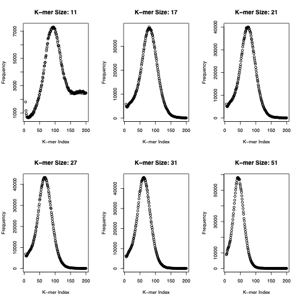
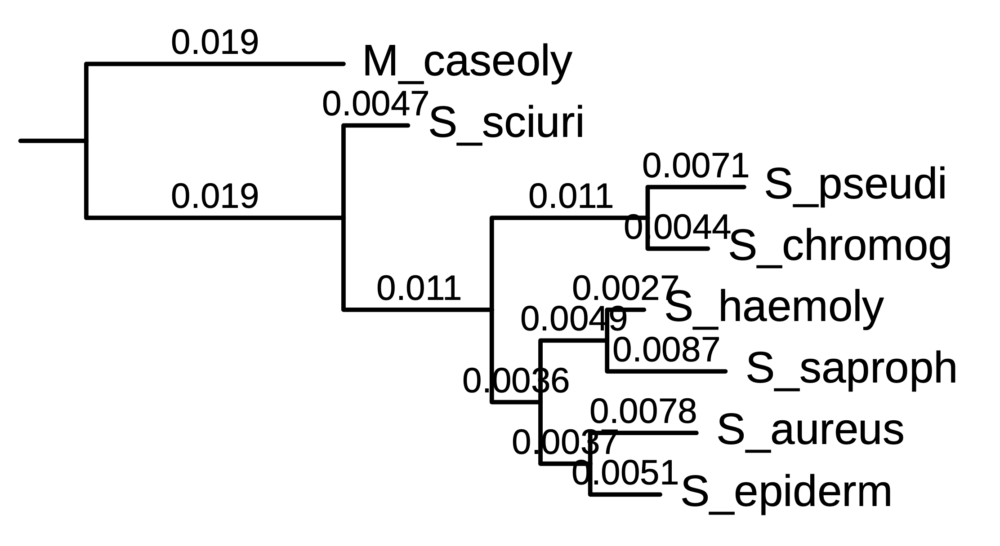
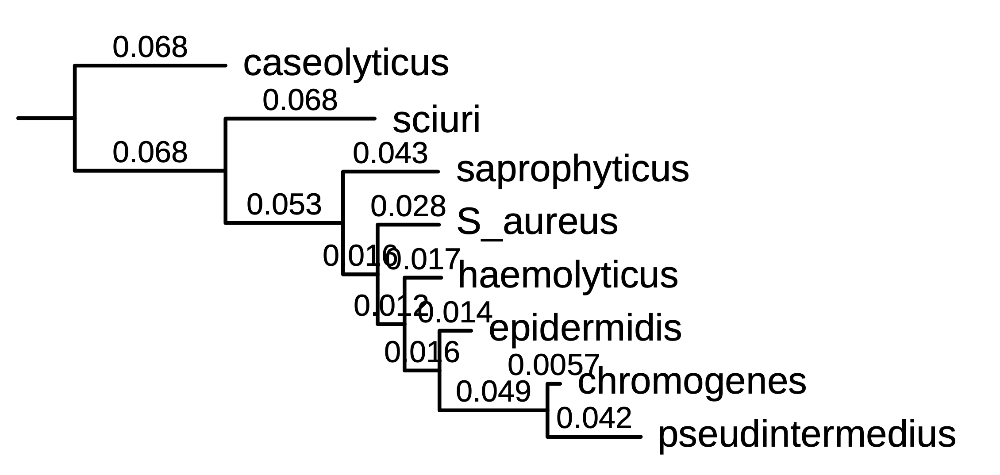

# BINF7001 ASSESSMENT 3 (2024) | De novo genome assembly and phylogenomics

# 1. Genome data and assembly

## 1.1 Sequencing data

My dataset is ERR9872452. It was sequenced using the ILLUMINA NextSeq 500 sequencing platform. It produces 2x 150bp reads, with a total read count of 2197746. The G+C content is approximately 38%.


## 1.2 Genome assembly

## (a) Approach

I used the velvet program to assembly the genome. Velvet requires a kmer parameter to be selected. I used the jellyfish program to count various kmers and graph them. Values tested were k=11, 17, 21, 27, 31, 51. 


**Figure: Frequency of k-mers for varying k values**

By visual inspection, either k=21, k=27 or k=31 would be good candidates. They all have a similar peak frequency of 40000. 

k=51 also has a similar peak frequency, but the sharp peak and long tail of k=51 could capture too many long, infrequent occurring kmers, leading to not enough overlaps. 

Too short would lead to ambiguity, with too many overlaps that may be incorrect or not meaningful; in the case of k=11, the kmer frequency peaks at about 7000. Short kmers are likely to appear in many places, so creating a high quality, reliable alignment will be more difficult.

Next, I used velveth to generate the metadata for the alignment, and velvetg to do the assembly.

I ran this pipeline for the proposed kmer values:

| kmer | N/L50 scaffold length | Maximum scaffold length | Total scaffold length | Total number of scaffolds | Contig mean length | % assembled |
|------|------|------|------|------|------|------|
| k21 | 82/9.227 KB | 60.132 KB | 2,514,955 | 1,082 | 99.98% | 2060637 / 2197746 (93.76%) |
| k31 | 36/22.561 KB | 105.043 KB | 2,532,370 | 521 | 99.99% | 2188030 / 2197746 (99.56%) |
| k41 | 391/2.038 KB | 10.011 KB | 2,663,113 | 3,166 | 100.00% | 2160007 / 2197746 (98.28%) |
| k51 | 44/18.254 KB | 54.926 KB | 2,506,012 | 464 | 99.99% | 2165246 / 2197746 (98.52%) |
| k61 | 55/14.643 KB | 45.492 KB | 2,455,163 | 401 | 99.85% | 2134797 / 2197746 (97.14%) |
| k71 | 38/20.195 KB | 65.611 KB | 2,439,224 | 254 | 99.83% | 2106757 / 2197746 (95.86%) |


I settled on k=31. Here's why:

- Has a high level of completeness (99.56%).
- While the number of scaffolds that contribute to 50% of the length is low (36), the 50th largest is 22.563KB. This means we have a smaller number of longer scaffolds - this indicates larger, more complete scaffolds.
- The largest value is very large (105KB). Although only one scaffold, this metric supports the 36/22.561KB figure, and is further evidence for k=31, the final assembly is not fragmented.

## (b) N50 scaffold length

36 KB

## (c) Maximum scaffold length
## (d) Total scaffold length
## (e) Total number of scaffolds
## (f) Percentage of reads that are assembled into contigs
## (g) Mean coverage for all contigs

# 2. Ab initio gene prediction

## (a) Brief description of your approach

I used the mat file from the practical. It is for Staphylococcus Aureus; my sample is Staphylococcus Pseudintermedius, which is known to be very genetically similar and have many common proteins. I would like to build my own matrix file and see how that compares, if time permits. 
I used GeneMark to predict genes:

```sh
genemark -opn -m /opt/BINF7001/2024/Prac8_2024/Staph_aureus_JKD6008.mat ./k31/contigs.fa
```

According to GeneMark, the GC content is 37.5% - this aligns with what we expected.


## (b) Total number of predicted genes

The total number of predicted genes is 4560, found using the following command:

```sh
cat k31/contigs.fa.orf | grep "^>" | wc -l
```

## (c) Average gene length

The average length of the predicted genes is 302 amino acids. This was derived using a Python script (see appendix 1) from the `protein.fa.orf`, which the proteins as extracted from the GeneMark `configs.fa.orf`.

## (d) Length and function of the longest gene

Longest gene is 1571 amino acids, also derived using the Python script. I ran a BLAST on the protein on NCBI and the best matches suggest this protein is either 

- LPXTG-anchored putative endo-alpha-N-acetylgalactosaminidase SpsG
- YSIRK-type signal peptide-containing protein

Both have been suggested to help secure surface proteins to the cell wall in gram-positive bacteria (Bae, 2003).


# 3. Phylogenomic analysis (maximum two pages; 8)

## (a) Brief description of your approach (name(s) of program(s), key parameters used) 

After using GeneMark to predict genes, I create three blast databases using the `makeblastdb` program. One for the contigs (`contigs.fa`, one for the genes (nucleotides, `nt.fa`) and one for the proteins (`protein.fa`). 

```sh
makeblastdb -dbtype nucl -in inputs/contigs.fa
makeblastdb -dbtype nucl -in inputs/nc.fa
makeblastdb -dbtype prot -in inputs/protein.fa
```

I then used `blastn` query my `nt` and `contigs` databases using the 16s rRNA as the query. The query against `contigs.fa` found 2 results; the query against `nt.fa` provided none. This means two contigs sequences have similarity to the 16s rRNA query.

```sh
echo "Query inputs/contigs.fa"
blastn -query gene_query.fa -db inputs/contigs.fa -outfmt 6 -evalue 1e-10

echo "Query inputs/nc.fa"
blastn -query gene_query.fa -db inputs/nc.fa -outfmt 6 -evalue 1e-10
```

Here's the two hits, shortened for brevity:

```
# Query inputs/contigs.fa
16S_rRNA	NODE_12_length_1715_cov_724.954529	94.565	1748	73	17	121	1849	1745	1	0.0	2682
16S_rRNA	NODE_977_length_54_cov_585.851868	91.935	62	0	1	1934	1995	1	57	7.97e-16	82.4
# Query inputs/nc.fa
None!
```

The two hits are 94.5% and 91.9% similar representing a similar match. The length is 1748 for the first candidate, and 62 for the second. The first hit is substantially longer, and represents a more complete match.

I extracted it with:

```sh
samtools faidx -i inputs/contigs.fa NODE_12_length_1715_cov_724.954529:1-1745
```

## (b) Total number of homologous protein groups, and number of single-copy groups 

I created a new directory, `my_proteins` and softlinked the 7 protein databases. I included my own (`protein.fa`). I ran `orthofinder -og -f my_proteins`.

The console output after running says "OrthoFinder assigned 17605 genes (92.2% of total) to 2795 orthogroups". There are 1008 single-copy genes.

## (c) 16S rRNA gene tree (8 taxa, rooted using outgroup)



We can infer a tree using MUSCLE and convert to `nex` for usage with MyBayes:

```sh
muscle -in all_16s.fa > 16s_rRNA_gene_tree.aln
readseq -a -f17 16s_rRNA_gene_tree.aln > 16s_rRNA_gene_tree.nex
```

We can then run inference using MrBayes by appending some MrBayes code:

```sh
begin mrbayes;
  set autoclose=yes;
  mcmc ngen=4000000 nchains=4 burnin=2000;
  lset nucmodel=4by4 rates=gamma ngammacat=4;
  sump;
  sumt conformat=simple contype=allcompat;
end;
```

I rooted by selecting Macrococcus caseolyticus as an outgroup. I did this both using visual intuition by viewing the tree in an unrooted fashion and selecting the group that looked the furthest away based on branch length. I also applied biological intuition; it is a separate genus, and likely to be furthest from the others, which are all in the Staphylococcus genus.

## (d) protein tree of the chosen housekeeping gene (8 taxa, rooted using outgroup)




I chose recA. The method to generate the tree and select an outgroup was the same above.

## (e) one key difference/similarity between the two trees

The recA tree shows rapid evolutionary divergence. The recA gene has had to evolve rapidly and frequently to survive. The 16S rRNA tree has less rapid divergence; there are several local "clumps", which indicates that several species may have diverged recently. 

## (f) one plausible explanation as to why such a difference occurs

recA is a gene associated with DNA maintenance and repair (Lusetti, 2002). This would require rapid adaptation - an organism that cannot repair DNA will not survive long.

16S rRNA encodes a component of the ribosome. This is essential for protein synthesis and any change to it is likely to be to be detrimental to survival. This constraint results in slow evolution.
 
 It's stability and highly conserved nature make it very useful for constructing phylogenies.

# References

Bae, T., & Schneewind, O. (2003). The YSIRK-G/S motif of staphylococcal protein A and its role in efficiency of signal peptide processing. Journal of bacteriology, 185(9), 2910–2919. https://doi.org/10.1128/JB.185.9.2910-2919.2003

Lusetti, S. L., & Cox, M. M. (2002). The bacterial RecA protein and the recombinational DNA repair of stalled replication forks. Annual review of biochemistry, 71(1), 71-100.

# Appendix


## Appendix 1: Python Script

Useful for finding average and longest read in a FASTA file.

# usage
# cat predict/protein.fa.orf | python av_length.py

```python
import sys

def read_stdin():
    lines = []
    for line in sys.stdin:
        line = line.strip()

        if line.startswith(";"):
            continue

        if line.startswith(">") or len(line) > 0:
            lines.append(line)

    return lines

def parse_genes(lines):
    gene = ""
    genes = []
    for line in lines:
        if line.startswith(">"):
            genes.append(gene)
            gene = ""
        else:
            gene += line
    return genes

def av_length(genes):
    total = sum(map(lambda x: len(x), genes))
    return round(total / len(genes))

def find_longest(genes):
    best = genes[0]
    for gene in genes:
        if len(gene) >= len(best):
            best = gene
    return best

lines = read_stdin()
genes = parse_genes(lines)
mean = av_length(genes)
print(f"Mean length of genes: {mean}")

longest = find_longest(genes)
print(f"Longest gene: {len(longest)}. {longest}")
```
